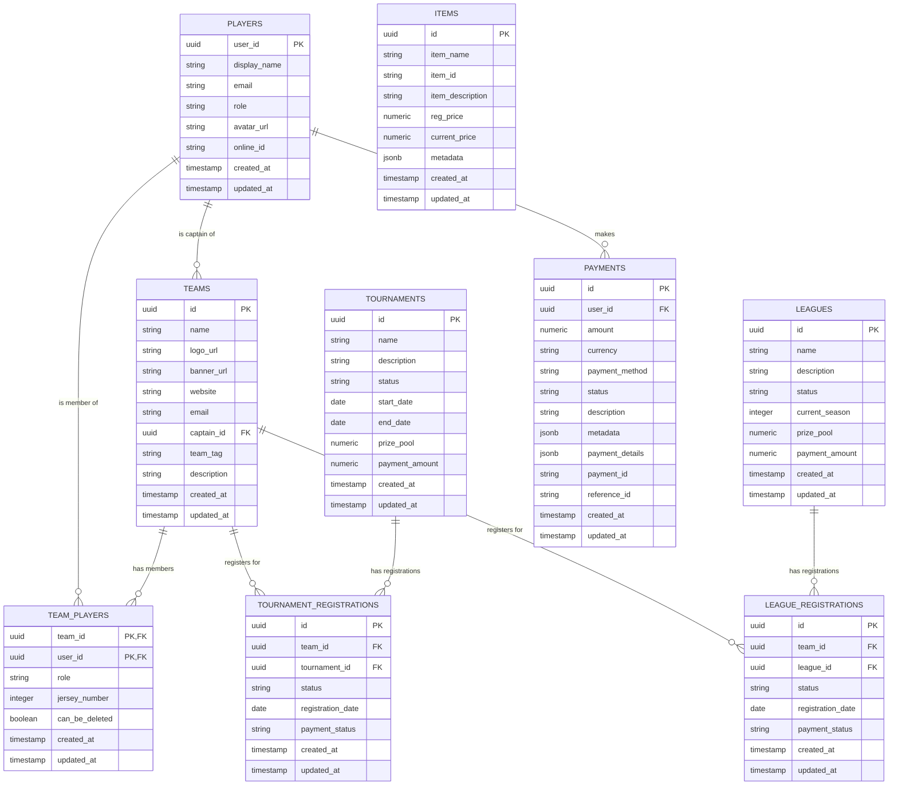

# MGL Website Database Schema

## Entity Relationship Diagram

## Table Descriptions

### Players
Stores information about players in the system.
- `user_id`: Primary key, references auth.users
- `display_name`: Player's display name
- `email`: Player's email address
- `role`: Player's role (user, admin, owner)
- `avatar_url`: URL to player's avatar image
- `online_id`: Player's online gaming ID

### Teams
Stores information about teams in the system.
- `id`: Primary key
- `name`: Team name
- `logo_url`: URL to team logo
- `banner_url`: URL to team banner
- `website`: Team website URL
- `email`: Team contact email
- `captain_id`: Foreign key to players.user_id, team captain
- `team_tag`: Team tag/abbreviation
- `description`: Team description

### Team Players
Junction table linking players to teams.
- `team_id`: Foreign key to teams.id
- `user_id`: Foreign key to players.user_id
- `role`: Player's role in the team (captain, player)
- `jersey_number`: Player's jersey number
- `can_be_deleted`: Whether the player can be removed from the team

### Tournaments
Stores information about tournaments.
- `id`: Primary key
- `name`: Tournament name
- `description`: Tournament description
- `status`: Tournament status (upcoming, registration, active, completed, cancelled)
- `start_date`: Tournament start date
- `end_date`: Tournament end date
- `prize_pool`: Tournament prize pool amount
- `payment_amount`: Registration fee amount

### Leagues
Stores information about leagues.
- `id`: Primary key
- `name`: League name
- `description`: League description
- `status`: League status (active, inactive, archived, registration)
- `current_season`: Current season number
- `prize_pool`: League prize pool amount
- `payment_amount`: Registration fee amount

### Tournament Registrations
Stores team registrations for tournaments.
- `id`: Primary key
- `team_id`: Foreign key to teams.id
- `tournament_id`: Foreign key to tournaments.id
- `status`: Registration status
- `registration_date`: Date of registration
- `payment_status`: Payment status (pending, paid, failed, refunded)

### League Registrations
Stores team registrations for leagues.
- `id`: Primary key
- `team_id`: Foreign key to teams.id
- `league_id`: Foreign key to leagues.id
- `status`: Registration status
- `registration_date`: Date of registration
- `payment_status`: Payment status (pending, paid, failed, refunded)

### Payments
Stores payment information.
- `id`: Primary key
- `user_id`: Foreign key to auth.users
- `amount`: Payment amount
- `currency`: Payment currency
- `payment_method`: Payment method (square, cashapp, etc.)
- `status`: Payment status (pending, completed, failed, refunded, processing)
- `description`: Payment description
- `metadata`: Additional metadata as JSONB
- `payment_details`: Payment processor details as JSONB
- `payment_id`: External payment ID from payment processor
- `reference_id`: Internal reference ID for tracking payment purpose

### Items
Stores purchasable items in the system.
- `id`: Primary key
- `item_name`: Item name
- `item_id`: 4-digit unique identifier
- `item_description`: Item description
- `reg_price`: Regular price
- `current_price`: Current price
- `metadata`: Additional metadata as JSONB

## Key Relationships

1. **Players to Teams**: A player can be the captain of multiple teams (one-to-many)
2. **Players to Team Players**: A player can be a member of multiple teams (one-to-many)
3. **Teams to Team Players**: A team has multiple players (one-to-many)
4. **Teams to Tournament Registrations**: A team can register for multiple tournaments (one-to-many)
5. **Teams to League Registrations**: A team can register for multiple leagues (one-to-many)
6. **Tournaments to Tournament Registrations**: A tournament has multiple team registrations (one-to-many)
7. **Leagues to League Registrations**: A league has multiple team registrations (one-to-many)
8. **Players to Payments**: A player can make multiple payments (one-to-many)

## Database Constraints

### Check Constraints
- `payments_status_check`: Ensures payment status is one of: pending, completed, failed, refunded, processing
- `items_item_id_format_check`: Ensures item_id is a 4-digit number
- `tournaments_status_check`: Ensures tournament status is one of: upcoming, registration, active, completed, cancelled
- `leagues_status_check`: Ensures league status is one of: active, inactive, archived, registration
- `tournament_registrations_payment_status_check`: Ensures payment status is one of: pending, paid, failed, refunded
- `league_registrations_payment_status_check`: Ensures payment status is one of: pending, paid, failed, refunded

### Foreign Key Constraints
- `team_players_user_id_fkey`: Ensures team_players.user_id references players.user_id
- `teams_captain_id_fkey`: Ensures teams.captain_id references players.user_id
- `tournament_registrations_team_id_fkey`: Ensures tournament_registrations.team_id references teams.id
- `tournament_registrations_tournament_id_fkey`: Ensures tournament_registrations.tournament_id references tournaments.id
- `league_registrations_team_id_fkey`: Ensures league_registrations.team_id references teams.id
- `league_registrations_league_id_fkey`: Ensures league_registrations.league_id references leagues.id

## Indexes
The database includes various indexes to optimize query performance:

### Single-Column Indexes
- `idx_players_display_name`: Optimizes searches by player name
- `idx_teams_name`: Optimizes searches by team name
- `idx_tournaments_name`: Optimizes searches by tournament name
- `idx_leagues_name`: Optimizes searches by league name
- `idx_tournaments_status`: Optimizes filtering by tournament status
- `idx_leagues_status`: Optimizes filtering by league status
- `idx_tournament_registrations_status`: Optimizes filtering by registration status
- `idx_league_registrations_status`: Optimizes filtering by registration status
- `idx_payments_user_id`: Optimizes filtering payments by user
- `idx_payments_status`: Optimizes filtering payments by status
- `idx_payments_created_at`: Optimizes sorting payments by creation date
- `idx_payments_reference_id`: Optimizes searching payments by reference ID

### Composite Indexes
- `idx_tournament_registrations_team_tournament`: Optimizes queries that filter by both team and tournament
- `idx_league_registrations_team_league`: Optimizes queries that filter by both team and league
- `idx_team_players_team_role`: Optimizes queries that filter by both team and role

### GIN Indexes
- `idx_payments_metadata`: Optimizes JSON queries on payment metadata 