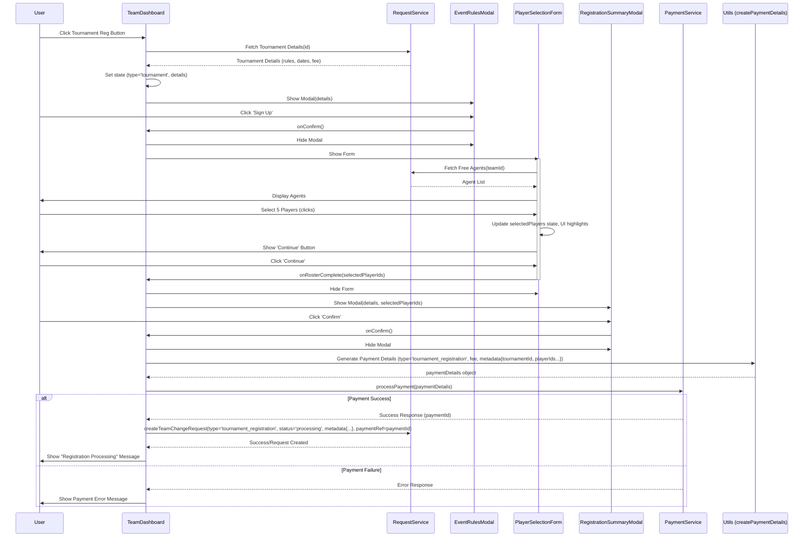

# Frontend Registration Flow Implementation Plan

## Objective

Implement new multi-step UI flows for League and Tournament registration within the frontend, replacing the existing simple pop-ups. This plan targets the backend execution flow described in `dev_notes.md` (using status `'processing'` to trigger a database function).

## Target Component

The primary component to modify for initiating these flows is `frontend/src/pages/dashboard/TeamDashboard.tsx`.

## Backend Flow Assumption

This plan assumes the backend operates as described in `dev_notes.md`:

- Frontend initiates payment via `PaymentService.ts` using `createPaymentDetails`.
- On successful payment, frontend calls `RequestService.ts` to create a `team_change_requests` record with `status: 'processing'`.
- A database trigger (`handle_request_status_update` or similar) detects the `'processing'` status and executes the registration logic (this trigger may need updating to handle league/tournament types).

## API/Data Assumption

This plan assumes the following are available via frontend services (e.g., `RequestService.ts`):

- Endpoints to fetch League details (rules, dates, fee, ID).
- Endpoints to fetch Tournament details (rules, dates, fee, ID).
- Endpoints to fetch available "Free Agents" for a given team.

## Phase 1: Setup & Component Creation

1.  **Create New Components:**
    - `frontend/src/components/modals/EventRulesModal.tsx`: Reusable modal for displaying event rules, dates, fees, and Sign Up/Cancel buttons.
    - `frontend/src/components/modals/RegistrationSummaryModal.tsx`: Reusable modal for displaying the final summary (event details, roster, price) and Confirm/Cancel buttons.
    - `frontend/src/components/registration/PlayerSelectionForm.tsx`: Component for fetching/displaying free agents, handling player selection (highlighting, tracking count), and showing the 'Continue' button.
2.  **Add State Management (in `TeamDashboard.tsx`):**
    - Use React Hooks (e.g., `useState`) to manage:
      - `currentRegistrationType`: `'league'` | `'tournament'` | `null`
      - `isRulesModalOpen`: `boolean`
      - `isSummaryModalOpen`: `boolean`
      - `isPlayerSelectionVisible`: `boolean`
      - `selectedEventDetails`: Object containing fetched league/tournament data.
      - `availableAgents`: Array of agent objects.
      - `selectedPlayerIds`: Array of player IDs.
      - `registrationStep`: Number or string indicating the current step.

## Phase 2: Implementing the Flow (Tournament Example)

1.  **Modify `frontend/src/pages/dashboard/TeamDashboard.tsx`:**
    - Locate the "Tournament Registration" button.
    - Update its `onClick` handler:
      - Call `RequestService.fetchTournamentDetails(tournamentId)`.
      - On success: Store details in `selectedEventDetails` state, set `currentRegistrationType` to `'tournament'`, set `isRulesModalOpen` to `true`.
      - Handle errors.
2.  **Implement `EventRulesModal.tsx`:**
    - Props: `eventType`, `eventDetails`, `onConfirm`, `onCancel`.
    - Display details. Wire buttons to callbacks.
3.  **Handle Rules Modal Confirmation (`onConfirm` in `TeamDashboard.tsx`):**
    - Set `isRulesModalOpen` to `false`.
    - Set `isPlayerSelectionVisible` to `true`.
    - _(Animation)_ Add CSS transitions for smooth modal closing.
4.  **Implement `PlayerSelectionForm.tsx`:**
    - Props: `eventType`, `eventDetails`, `teamId`, `onRosterComplete`.
    - `useEffect` hook to fetch free agents via `RequestService.fetchTeamAgents(teamId)`.
    - Display agents. Implement hover/selection UI (CSS classes).
    - Manage internal state for selected players.
    - Render "Continue" button when 5 players are selected. Wire it to `onRosterComplete(selectedIds)`.
5.  **Handle Roster Completion (`onRosterComplete` in `TeamDashboard.tsx`):**
    - Store `selectedPlayerIds` in state.
    - Set `isPlayerSelectionVisible` to `false`.
    - Set `isSummaryModalOpen` to `true`.
6.  **Implement `RegistrationSummaryModal.tsx`:**
    - Props: `eventType`, `eventDetails`, `selectedPlayers` (fetch full player details if needed based on IDs), `onConfirm`, `onCancel`.
    - Display summary. Wire buttons to callbacks.
7.  **Handle Summary Modal Confirmation (`onConfirm` in `TeamDashboard.tsx`):**
    - Set `isSummaryModalOpen` to `false`.
    - Generate a unique `requestId` (e.g., using `uuid`).
    - Call `createPaymentDetails` utility (type `'tournament_registration'`, fee, metadata including `tournamentId`, `teamId`, `selectedPlayerIds`, `requestId`).
    - Call `PaymentService.processPayment(paymentDetails)`.
    - **On Payment Success (async/await):**
      - Call `RequestService.createTeamChangeRequest({ ..., status: 'processing', request_type: 'tournament_registration', metadata: paymentDetails.metadata, payment_reference: paymentId, ... })`.
      - Display success/processing message.
    - **On Payment Failure:**
      - Display error message.

## Phase 3: Implementing the League Flow

- Repeat Phase 2 steps, adapting for League details and using `eventType: 'league'`, `request_type: 'league_registration'`.

## Phase 4: Refinement & Testing

1.  **Styling:** Apply consistent UI/UX, including animations.
2.  **Error Handling:** Implement comprehensive error handling for all async operations.
3.  **Testing:** Thoroughly test both flows, edge cases, and error states. Verify backend `team_change_requests` creation with `'processing'` status.

## Flow Diagram (Tournament Example)

