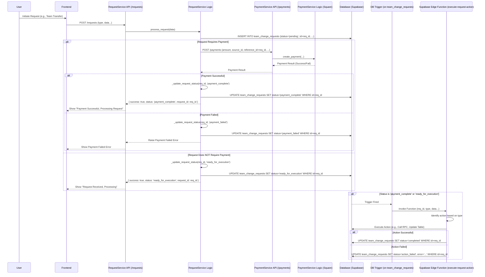

# Request Service and Payment System Refactoring Plan

## Objective

Refactor the interaction between the request service and payment system to ensure a consistent, asynchronous workflow for all request types, decoupling action execution from the initial API request and payment processing. This will leverage Supabase Database Triggers and Edge Functions.

## Identified Request Types

- `team_transfer`
- `roster_change`
- `tournament_registration`
- `league_registration`
- `team_rebrand`
- `online_id_change`
- `team_creation`

## Proposed Workflow

1.  **Initiation:** Any request (`POST /requests`) triggers `request_service.process_request`.
2.  **Record Creation:** A `team_change_requests` record is created with `status='pending'`.
3.  **Payment Check:**
    - **If Payment Required:** The service attempts payment via `payment_service`.
      - On **Success**: The request status is updated to `'payment_complete'`.
      - On **Failure**: The request status is updated to `'payment_failed'`, and an error is returned to the user.
    - **If Payment NOT Required:** The request status is immediately updated to `'ready_for_execution'`.
4.  **Database Trigger:** A trigger on the `team_change_requests` table fires whenever the `status` is updated to _either_ `'payment_complete'` OR `'ready_for_execution'`.
5.  **Edge Function Invocation:** The trigger invokes the `execute-request-action` Supabase Edge Function, passing the request details.
6.  **Action Execution (Edge Function):**
    - The Edge Function reads the `request_type` and other details.
    - It performs the specific action required (calls `admin_transfer_team_ownership` RPC, updates team name, registers for tournament, etc.).
    - Based on the outcome of the action, it updates the request status to `'completed'` or `'action_failed'`.

## Implementation Steps

1.  **Modify `backend/services/request_service.py`:**
    - Adjust `process_request` to remove the direct call to `_execute_action`.
    - Modify `_process_payment` and the main `process_request` logic to call `_update_request_status` with `'payment_complete'` after successful payment.
    - Modify `process_request` to call `_update_request_status` with `'ready_for_execution'` if `requires_payment` is false.
    - Ensure `_update_request_status` correctly handles these new statuses without triggering further actions _within the Python service_.
2.  **Create Supabase Edge Function (`execute-request-action`):**
    - Location: `supabase/functions/execute-request-action/index.ts`
    - Purpose: Contains the core logic for executing _all_ identified request types.
    - Implementation: Use TypeScript/Deno and the Supabase JS client. It will receive request details, determine the action based on `request_type`, call necessary database RPCs or make updates, and finally update the `team_change_requests` status to `'completed'` or `'action_failed'`.
3.  **Create Database Trigger Function (PL/pgSQL):**
    - Location: New Supabase migration file (e.g., `supabase/migrations/YYYYMMDDHHMMSS_create_request_trigger.sql`)
    - Purpose: To be executed by the database trigger. It will invoke the Supabase Edge Function.
    - Implementation: A PL/pgSQL function that extracts relevant data from the updated `team_change_requests` row and uses `supabase.functions.invoke('execute-request-action', payload)` (likely via the `pg_net` extension, ensure it's enabled) to call the Edge Function.
4.  **Create Database Trigger:**
    - Location: Same migration file as the trigger function.
    - Table: `team_change_requests`
    - Event: `AFTER UPDATE`
    - Condition: `WHEN (OLD.status IS DISTINCT FROM NEW.status AND NEW.status IN ('payment_complete', 'ready_for_execution'))`
    - Action: `EXECUTE FUNCTION your_trigger_function_name();`

## Flow Diagram

